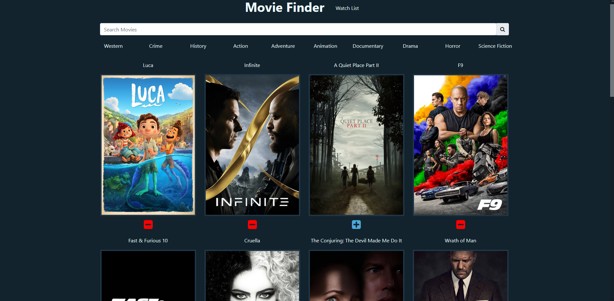

# MovieFinderApp
Movie Finder WebApp for Smarter Services using ReactJS

# Running Locally
For this project I use dotenv for my environment variables
make a .env file in the root of the directory with the contents
`REACT_APP_API_KEY=<yourTMDbAPIkey>`
so that the API calls can be authorized correctly

To build the project first run
```
npm install
``` 
then
```
npm start
```
which will start the locally hosted webapp and should open it in your default web browser
and it should look something like this!




# Thoughts on Project: 

So after reading through the project description I determined I was going to be using Bootstrap4 for some easy to scale and setup design structure. As well as MobX for State Management and axios for my API GET requests.

## Ability to search for movies based on keywords
So after getting a basic react template setup I started on the basic search function, I used an observable object for my store(listed as MovieStore.js in src/stores/) and made an array to hold my movies and two functions for getting movies, one for requesting popular movies using the discover enpoint to list some popular movies, and a second function for querying movies from the search endpoint using the search bar's state as the query's keyword. After getting that done I focused on styling the Movie Search's page to make the items look more uniform as well as adding a modal to show the movie's overview and ratings.

## Ability to add movies found through search to watch list
So for starting this feature I just added a store for the wish list movies and added a FontAwesome icon to each individual item and made sure that it was appending the movie to the store. I also decided to add the feature to remove items from the wish list in this step as I wanted to have the ability to remove movies before making the items visible.

## making watch list 
So for the watch list I used a component similar to the MovieItem except used headers for the titles and displayed a single line of the overview as well as added another modal for the watch list as well for consistency 

## Implementing local storage
Implementing local storage was fairly simple with just converting the WatchListStore's movies array to JSON(as it can only accept strings) then parsing it when needed and updating the local storage when the array was edited 

## Discover Genres feature
This feature just involved adding an additional function the the MovieStore for searching for movies by genres and adding a few items to run the search for each individual genre

## Page stepper feature
I felt this was the most important feature, especially with the ability to discover genres you may want more of a selection than 20 movies, so I added a default paramater to each of the GET request functions for a page integer, that when overriden would grab the page that was passed in, which is set by the pageNum state in the MovieSearch component and reset each time a new type of request is sent. After getting the basic page stepper done I added anotehr two Font Awesome Icons to go to the last and first page of the search, simply done by getting the total_pages from the JSON response.